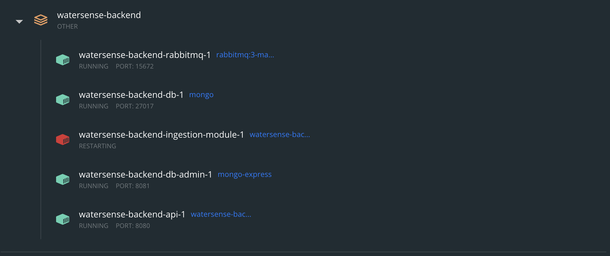

# WaterSense Backend

Monorepo for all backend microservices.

## Components

Refer to each component's section for detailed startup instructions for local development.

1. [API Server](#api-server) - Microservice that provides APIs for [watersense-ui](https://github.com/seanjin97/watersense-ui). 
2. [Ingestion Module](#ingestion-module) - Microservice that saves incoming message stream from RabbitMQ broker from sensor origin. 
3. [MongoDB](./mongodb) - NoSQL DB to store data streamed from sensor. This folder serves as a docker volume to persist data on the local container instance. Delete the data folder to reset all data. 
4. [RabbitMQ](./rabbitmq) - Messaging broker. This folder serves as a docker volume to persist data on the local container instance. Delete the data folder to reset all data.

## Running watersense-backend locally

This runs all components as docker containers.

1. Install [Docker](https://www.docker.com/products/docker-desktop).
2. Install [Python Poetry](https://python-poetry.org/docs/#installation). This is to handle python envs.
3. Run the command to start up all components. `$ docker compose up`
4. You should see this on first start up. The ingestion-module relies on an exchange to be created. The sensor handles the creation of this exchange, the ingestion module only subscribes to the exchange. Since the exchange is not created yet, the ingestion-module will crash. 
5. Open a new terminal and navigate to the ingestion-module. `$ cd ingestion-module`
6. Install the ingestion-module dependencies. `$ poetry install`
7. Activate the virtual env. `$ poetry shell`
8. Run the sample producer that simulates data being streamed from the sensor. `$ python src/mock_sensor.py`
 
Ingestion module will stop crashing and you should see this. 
9. Go to the RabbitMQ console to verify that RabbitMQ is working. http://localhost:15672. 
`Username: root, Password: root`


10. Go to the MongoDB admin console to verify that MongoDB is working. http://localhost:8081. 
`Username: root, Password: root`

11. Go to the api-server swagger docs to test available apis. http://localhost:8080/swagger. 

# Local development

## API Server 

Deployed server at https://watersense-api-watersense-seanjin97.cloud.okteto.net/swagger
### How to run

Running api-server locally.

#### Via docker (If you prefer to develop while the code is running in the docker container)

1. Start watersense-backend. [Refer to steps above](#running-watersense-backend-locally).
2. Modify source code, the docker container will hot reload on code change. # Note: if new env variables or dependencies are added, the docker image will need to be rebuilt. Stop the docker compose with `$ docker compose down`, followed by deleting the `watersense-backend_api` image. Finally, re-run the docker compose.

#### Via source code (If you prefer to develop and run the code directly.)

1. Start watersense-backend. [Refer to steps above](#running-watersense-backend-locally)
2. Stop the `watersense-backend-api-1` container since you'll be running the server on command line.
2. `$ cd api-server`
3. `$ poetry install`
4. `$ poetry shell`
5. `$ python src/main.py`

### Project structure

Outline of api-server microservice.

```
api-server
    src
        .env
        main.py - app entrypoint.
        config
            config.py - reads values from .env file.
            db.py - connects to DB.
        dao
            sensor.py - functions to interact with the DB.
        models - pydantic models for FastAPI.
```

## Ingestion Module

### How to run

Running ingestion-module locally.

#### Via source code

1. Start watersense-backend. [Refer to steps above](#running-watersense-backend-locally)
2. Stop the `watersense-backend-ingestion-module-1` container since you'll be running the server on command line.
2. `$ cd ingestion-module`
3. `$ poetry install`
4. `$ poetry shell`
5. `$ python src/main.py`

### Project structure

Outline of api-server microservice.

```
ingestion-module
    src
        .env
        main.py - app entrypoint.
        ampq_sample_producer.py - to simulate sensor sending data.
        config
            config.py - reads values from .env file.
            db.py - connects to DB.
            amqp.py - connects to rabbitmq.
        dao
            sensor.py - functions to interact with the DB.
```